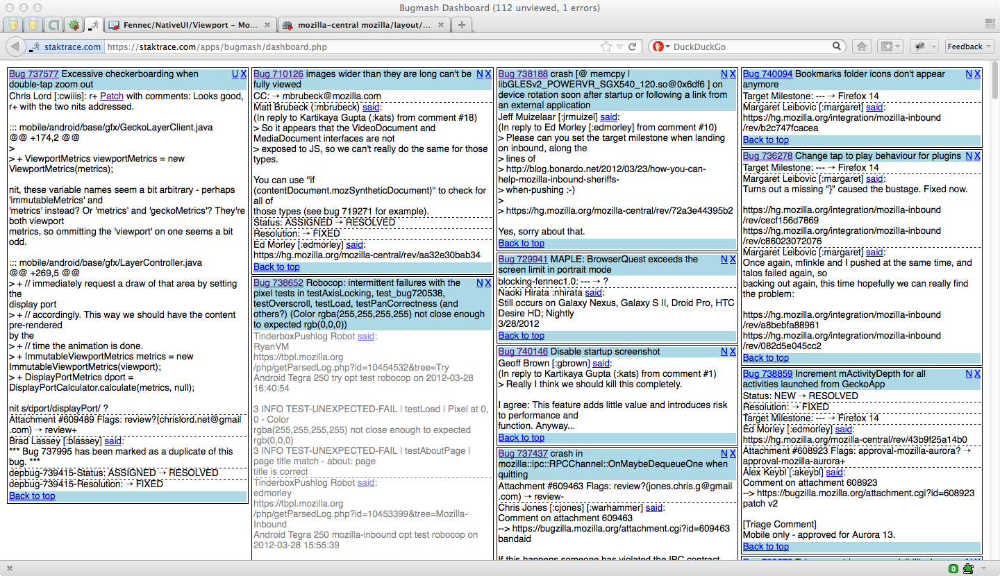
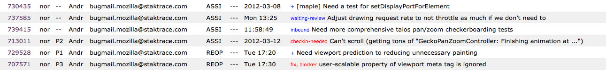

# Bugmash v0.1

A dashboard for quickly viewing and processing high volumes of bugmail. Also comes with the ability to add private notes and tags to bugs, and have those tags show up on Bugzilla itself (via a Scriptish user script).

*   Source code available at: [https://github.com/staktrace/bugmash](https://github.com/staktrace/bugmash)
*   Original author: Kartikaya Gupta
*   Contributors: maybe you!

Jump to section: [Quick Setup](#qsetup) | [Detailed Setup](#dsetup) | [Usage](#usage) | [Known Issues](#kissues) | [Areas for improvement](#improve)

## Quick Setup

Bugmash is NOT trivial to install. At least, not yet. It also requires that you have some infrastructure set up on your part (database, PHP, etc.) to be able to run the different pieces. Therefore, use of bugmash is not for the faint of heart, and is really only recommended if the volume of bugmail you receive (or want to receive) is stupendous. A good qualification factor might be that you have declared bugmail bankruptcy at least once. Therefore, there is no quick setup. Work your way through the detailed setup instructions if you're still interested.

## Detailed Setup

Bugmash has a number of components that work together. The way you set up these components can vary somewhat, but you may need to twiddle a few things here and there to get things to work if you deviate too far from how I've set it up. Ideally as more people try to use it, they will contribute patches to make this easier. As it is, you should probably read through these instructions first before even attempting to set it up.

First, there is an email scraper. This is contained in the filter.php file. You will need to set up your Bugzilla email such that you can feed the bugmail into this php script. The way I have it set up is I have my Bugzilla email account redirect to a mailbox on my webhost account (of the form myusername+bugmash@myaccountserver.dreamhost.com), and then I have a .forward file in my webhost account with a line like the one below:

`"| /home/myusername/path/to/filter.php"`

This takes all incoming email and pipes it to the filter.php script. Make sure you mark filter.php as executable, and update the hashbang line at the top to point to your php interpreter. The scraper extracts useful information from Bugzilla emails, and stuffs it into a MySQL database (which is the second component, detailed below). If you want to be able to process PGP/GPG-encrypted bugmail as well, you can additionally pipe the mail through decrypt_mail.awk before piping it to filter.php. This assumes you have no passphrase on your gpg key, such that "gpg --decrypt" will successfully decrypt stdin to stdout. In this case, your .forward file might look like this:

`"| /home/myusername/path/to/decrypt_mail.awk | /home/myusername/path/to/filter.php"`

The second component is a MySQL database. This is where all the bug data is actually stored after being extracted from the emails. You will need to set up a database with the necessary tables (schemas are in tables.sql). You will also need to rename the example.config.php file to bugmash.config.php and put your database access information into it. While you're at it, also fill in $_ME in the config file with the email address on your Bugzilla account (i.e. what shows up when you go to Bugzilla preferences). If you have multiple Bugzilla accounts you can put them all in.

**IMPORTANT!** Make sure that the bugmash.config.php file is not in your web server's document root (generally $HOME/www), otherwise your database credentials may be at risk of being snarfed by evil crackers!!

So, with these two components, bugmail you receive should be getting parsed and inserted correctly. If you are piping emails to the script that are not bugmail, they will be saved to the folder you specify in the config file. If, for whatever reason, the email scraper is unable to parse an actual bugmail, it will save the bugmail, along with a corresponding .err file, to the same directory that filter.php is in. This is so that you don't lose any bugmail, and can improve the scraper to handle the failures. (The most frequent reason this happens is when an unknown bug field changes value.)

The third component is the front-end, which consists of the common.php, dashboard.php, wipe.php, and search.php files. These should be installed into a directory and served via a normal PHP-supporting webserver (e.g. Apache with mod_php). You will need to modify the $BUGMASH_DIR variable in common.php so that it can find the bugmash.config.php file with the database credentials. Once you have this set up, you can access the dashboard by going to the dashboard.php in your favourite web browser (i.e. Firefox).

**IMPORTANT!** You should probably lock down access to the dashboard (and the other web-facing .php files) by using .htaccess or some other kind of authentication. Failure to do so could allow evil crackers to walk right in and mark all your bugmail as read!!

Now, if you have set all of that up, there is one final (optional) component you can install. This consists of the tags.php file, which should be placed in the same web-facing directory as common.php, and the bugtags.user.js user script. This user script can be installed into Scriptish (a Firefox add-on) and modifies Bugzilla bug listing pages (such as the "My Bugs" page, or any search results page) to display and edit your personal bug tags. Before installing the user script into Scriptish, make sure you modify the TAGS_SERVER variable as appropriate so that it points to your web-facing tags.php file.

## Usage

As with most power tools, there are many intricacies to using Bugmash. These are documented here in favour of keeping the actual interface minimal and fast.

### Bug blocks

The primary mode of interaction with Bugmash is through the dashboard.php front-end. This will show all of the data from your bugmail that you have not marked as "viewed" at the time that the page is loaded. Note that the page does not auto-update or auto-refresh; you have to reload manually when you want to view the latest bug information. This is by design because I hate pages that move content around under my cursor. Here is a screenshot of what the dashboard looks like:

All of the data for a given bug is contained inside a "bug block" (the thing with the blue header and footer). Note that if a bug is marked "secure" (so that the bugmail is PGP/GPG-encrypted), the header and border of the bug block is red instead. The header contains the bug number, the bug title, and two links in the top-right corner. The first link will be either "N" (for Note) or "U" (for Update). Clicking on this link will take you to the bottom of the dashboard, to the bug notes section, and allow you to add or edit the corresponding note and tag information for that bug. The "N" link will be displayed when there is no pre-existing note/tag, and the "U" link will be displayed when there is already a pre-existing note/tag for the bug. You can also hover your mouse over the "U" link to get the note/tag information in a tooltip.

The second link is an "X" that marks the bug block as viewed. Clicking on the X makes the bug block disappear and shifts the column up so that you can click on the X for the next bug block without moving your mouse. Note that when you mark a bug block as viewed, the block is hidden and an XMLHttpRequest is sent to the server; if that XMLHttpRequest fails, the bug block will be made visible again, and the "X" will be replaced with "[E]" (for Error). If this happens, you can click on the "[E]" to try again (it does the same thing as the X).

The data inside the bug block should be largely self-explanatory; it is basically a compressed version of the data you should be accustomed to seeing in normal bugmail. Note that URLs and bug numbers should be clickable even though they are not blue-and-underlined. This is to reduce visual noise for when you have a lot of them. The footer on the bug block has a link to take you back to the top of the bug block; this is useful for when the bug block is taller than a screen, or if you're on a mobile device with a small screen. The other noteworthy thing about bug block data is that comments made by TinderboxPushlog Robot will be greyed out. This allows you to quickly scan a bug block for a randomorange bug and see if there were any "real" comments made. Also something to note is that for better layout of bug data, whitespace in comments is often munged and/or thrown away (this also happens because of the way emails are parsed).

The bug blocks are arranged into four columns by default (on narrow screens the four columns get stacked into one column such that the leftmost column is on top and the rightmost is at the bottom). The four columns are generally arranged in decreasing order of importance from left to right. The leftmost column contains bugs that have a review requested of you, or contain a response to a review that you requested. The second column is for bugs that are assigned to you, or which you filed. The third column is for bugs you are CC'd on, or have voted on. The final column is for pretty much anything else (usually component-watching). If you would like to change this sorting behaviour, the column() function in dashboard.php is the place to look.

### Bug notes and tags

Below all the bug blocks is the bug notes section. Each bug note has a bug number, a note field, a tag field, and the bug title (if available). You can add notes/tags either by using the N/U link on the bug block, or the "Add note" button at the bottom of the section. Use the "Save notes" link to save changes (this will reload the whole page, rather than using XMLHttpRequest). Saving an empty note and tag for a bug removes that row from the notes section.

The primary difference between notes and tags is that, if you have the bugtags.user.js script installed, the tags will show up in Bugzilla next to the title of the bug on any bug listing page, such as shown in the screenshot below. If you do not have the userscript, then the tags field is redundant. Tags that start with a bang (!) will be displayed by the userscript in red, or blue otherwise. You can click on the tag to edit it; bugs with no tags will have a "+" that you can click to add tags. As tag updates from Bugzilla pages are done via XMLHttpRequest, they are shown in yellow while the update request is pending, and might revert to their old value if the update fails.

**WARNING!** Be careful when editing tags from both the Bugzilla userscript interface and the dashboard interface, as you may inadvertently clobber changes you made. In particular this may happen if you make a change from Bugzilla, and then make a change (possibly to a different bug's tag) from the dashboard without reloading it, and then saving the dashboard bug notes.

### Search

Below the bug notes section is the search field. This is a very bare-bones search that searches through your saved bug data. Search queries are split into tokens on whitespace, and only bugs that match all of the tokens are shown. The results are limited to bugs modified in the last 15 days, and are sorted by time (most recent first). Try not to search for really common substrings because there is no limiting on the number of hits other than recency, and the search implementation isn't particularly efficient - it may bring your server to its knees.

### Handling errors

Errors may occur if a bugmail cannot be parsed by the scraper. When this happens, the email and a corresponding .err file is saved into the folder where filter.php resides. The number of .err files is shown in browser window title bar when you are viewing the dashboard. This allows you to quickly check if there have been any errors. When an error occurs, you'll need to look at the .err file and the email to see why the email could not be parsed, and patch up the filter.php to handle it. Or you could file a bug against the github repo and get me to do it.

## Known issues

*   The code to strikethrough obsoleted review requests doesn't seem to be taking effect. Not sure where in the code this bug is, haven't really looked at it.
*   When concurrently editing tags via both the user script and the dashboard, it is easy to accidentally clobber tag changes. This should be detected and handled better.
*   Bugzilla comments which contain "--" on a single line will be prematurely terminated, since that is taken as the end-of-comment marker.
*   Review authors whose name/email wraps onto a second line in the email are not handled properly.

## Areas for improvement

*   Add a quick-reply form to comment on bugs
*   Beef up the search feature
*   Hook into the Bugzilla API for more awesome
*   Prune data from the database periodically
*   A way to undo marking bugs as viewed, in case of accidentally marking a bug as viewed
*   A way to specify a list of terms to highlight in bug blocks
